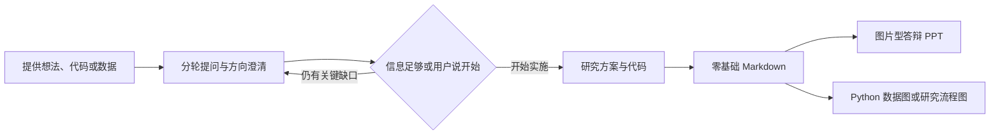
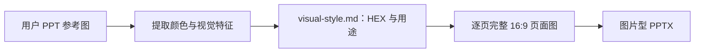
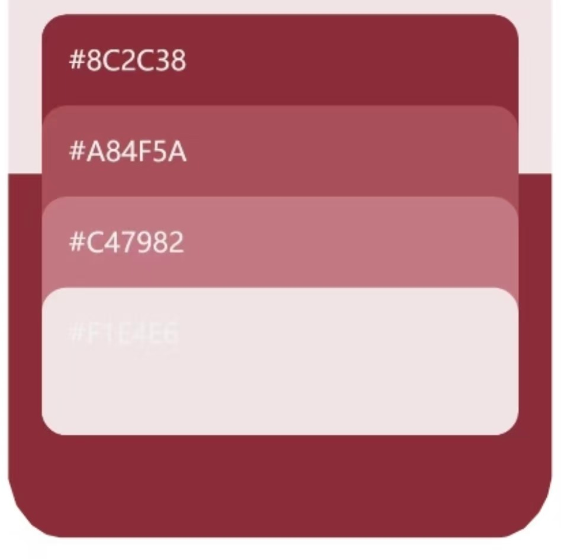
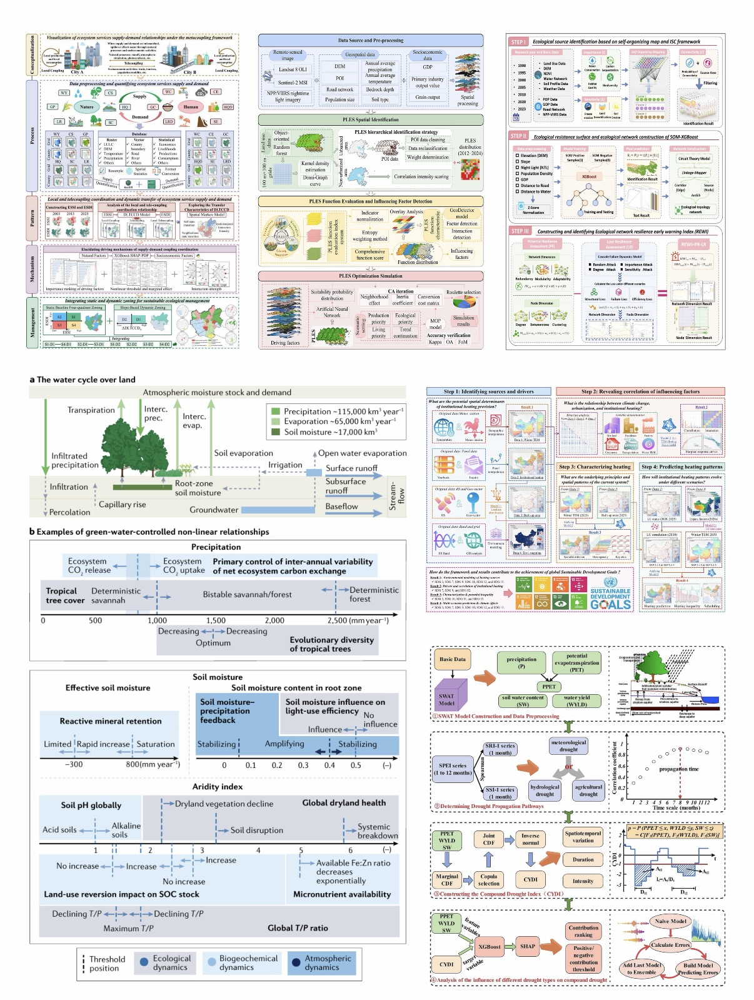

# Research Project Copilot

一个面向科研项目的 Codex Skill：先通过持续提问澄清研究方向与验收标准，再协助完成代码改进、零基础研究方案、图片型答辩 PPT 和顶刊风格论文插图。

**先问清研究方向，再把想法落到代码、文档和图上。** PPT 固定白色底，其余配色由你上传的一张 PPT 参考图决定。

## 工作流程



可以只使用其中一个模块，也可以串联完成整个研究汇报流程。

## 主要功能

- 用可检查的“执行准备度”代替虚假的置信度百分比；用户也可以随时明确说“开始”。
- 审计研究问题、技术路线、代码调用链、单位、数据处理、基线方法和验收标准。
- 将内容标为“已验证、代码声明、合理推断、待核实、研究计划”，避免把设想写成结果。
- 输出面向零基础读者的 Markdown 方案文档。
- 生成逐页独立的 16:9 图片型科研答辩 PPT。
- 使用 Python 制作论文数据图，并在必要时加入局部放大图。
- 根据研究信息生成模块化、顶刊风格的研究流程图。

| 模块 | 你提供什么 | 主要产物 |
| --- | --- | --- |
| 方向与代码 | 研究想法、现有代码、数据说明、运行限制 | 技术路线、改进方案、范围内的代码修改与验证 |
| 零基础文档 | 已确认思路、实现和实验信息 | `.md` 方案、术语解释、运行步骤与排错说明 |
| 答辩 PPT | 研究内容、一张 PPT 配色参考图 | 约 10 张独立页面图、图片型 `.pptx`、页纲与提示词 |
| 论文数据图 | 真实数据、变量定义、要表达的结论 | Python 绘图代码、图像及适用的矢量文件 |
| 研究流程图 | 数据来源、模块关系、输入输出、验证步骤 | 完整研究框图及生成提示词 |

### 方向确认如何进行

每轮围绕最关键的缺口提出 1–4 个问题，例如研究目标、输入输出、基线、数据划分或成功标准，同时说明当前理解和未确定事项。开始实施前会逐项检查：研究问题是否明确，数据与输出是否可定位，基线和改进是否可区分，指标与复现路径是否齐全，事实与计划是否分开，以及交付对象和时间是否明确。只有关键项足以支持当前任务时才开始，不用主观的“95% 概率”包装判断。

你可以随时说“开始，按已有信息做”。技能会记录必要假设并继续执行；缺失的实验结果不会被编造出来。

### 神经网络项目会讲到哪些内容

覆盖输入与输出的含义和形状、预处理、逐层/模块结构、激活与连接、损失函数、训练和推理过程、程序入口、框架及运行方法，并说明相对基线改了哪里、如何通过对照与消融实验验证。

## PPT：白底，参考图决定配色

上传一张你喜欢的 PPT 页面即可。技能会读取其中的主色、辅色、强调色以及文字和线条色，将它们组织为适合白底的统一视觉系统。即使参考页为深色背景，生成页面仍保持白底。



| 设计项目 | 规则 |
| --- | --- |
| 页面底色 | 固定为白色 `#FFFFFF` |
| 其他颜色 | 从本次参考图提取，必要时调整深浅以保证可读性 |
| 页数 | 默认约 10 页，根据内容增减 |
| 页面形式 | 每页一张完整 16:9 图片，分别保存 |
| 版式 | 根据研究内容选择流程、对照、层级或图文布局 |
| 统一性 | 全套保持颜色用途、标题层级、线条和图标风格一致 |
| 可编辑性 | 图片型 PPT 中的文字不作为独立文本框编辑 |

未上传新参考图时，自动采用技能创建时提供的酒红色板，无需重复上传。配色优先级是：**你的明确指定 → 本次 PPT 参考图 → 内置酒红参考图**；页面底色始终为白色。

<details>
<summary>查看内置酒红参考图（没有新参考图时自动采用）</summary>



</details>

## 论文数据图示例

下面的图片用于展示论文数据图的多面板组织、连续色带、图例和统计标注方式。它是用户提供的视觉参考，不是本技能生成的科研结果，图中的数据也不会被用于其他项目。



实际生成数据图时，会使用用户提供的真实数据和 Python/R 绘图代码，并根据差异大小决定是否加入局部放大图。

## 内容与证据约束

| 标签 | 含义 | 可以怎样表述 |
| --- | --- | --- |
| 已验证 | 有运行记录、原始数据、日志或可复现实验支持 | “测试集 RMSE 为……” |
| 代码声明 | 代码中确实存在，但尚未证明运行效果 | “程序定义了……” |
| 合理推断 | 由结构或上下文推导，尚需验证 | “可能用于……” |
| 待核实 | 当前材料不足或互相冲突 | “需补充日志确认……” |
| 研究计划 | 尚未完成的实验或改进 | “计划进行消融实验……” |

这套标签会贯穿 Markdown、PPT 和论文图。能运行不等于科学结论已经成立，代码参数也不自动等于论文最终参数。

## PPT 数据精确模式

当页面包含坐标轴、数值标签、误差线、统计显著性、混淆矩阵或定量热图时，技能优先用 Python 或 R 从源数据生成图表并保留矢量或高分辨率文件。图像生成模型只负责背景、装饰和不承载精确数值的示意元素，不能重新绘制定量图表。这样既能保持图片型 PPT 的整体设计，也不会牺牲数据准确性。

没有数据时，页面会明确标记“示意”“待验证”或“研究计划”，不会生成看似真实的实验数字。

## 安装

将整个仓库复制到 Codex skills 目录：

```text
~/.codex/skills/research-project-copilot/
```

随后可通过 `$research-project-copilot` 调用，也可以让 Codex 根据任务描述自动选择。

也可以使用 Git 克隆仓库；目标目录不存在时执行：

```powershell
# Windows PowerShell
git clone https://github.com/Songayu666/research-project-copilot.git "$env:USERPROFILE/.codex/skills/research-project-copilot"
```

```bash
# macOS / Linux
git clone https://github.com/Songayu666/research-project-copilot.git ~/.codex/skills/research-project-copilot
```

如已配置自定义 `CODEX_HOME`，使用该目录下的 `skills` 文件夹。

### 配套能力

本仓库是工作流指令与参考素材，不包含模型权重或完整绘图运行环境。使用不同模块时，需要相应能力：

| 场景 | 配套能力 |
| --- | --- |
| 图片型 PPT | `GordenImagePPTGen` 技能、图像生成工具及 PPT 合成依赖 |
| 论文数据图 | `nature-figure` 技能、Python 与所需绘图库 |
| 研究流程图 | `imagegen` 技能和可用图像生成工具 |
| 代码改进 | 项目本身所需的语言、框架与测试环境 |

上述配套技能没有随本仓库一起打包；缺少对应能力时，需要先在运行环境中配置。

## 目录

```text
research-project-copilot/
├── SKILL.md
├── agents/openai.yaml
├── references/
├── scripts/
└── assets/
    ├── palette-reference.png
    └── paper-data-figure-reference.jpg
```

`references/` 保存工作流规范，`scripts/validate_deliverables.py` 用于检查 Markdown、页面图片和生成记录，`assets/` 保存用户提供的默认色板与裁剪后的论文数据图版式参考。

## 使用示例

### 1. 从研究想法开始

```text
请使用 $research-project-copilot 帮我梳理一个神经网络科研项目。
在你对研究目标、输入输出、基线、数据和评价指标达到足够把握之前持续提问；
确认方向后生成零基础 Markdown 方案和答辩 PPT 设计。
```

### 2. 按上传的 PPT 参考图生成汇报

先附上研究材料和一张 PPT 参考图，再输入：

```text
请使用 $research-project-copilot 制作约 10 页科研答辩 PPT。
页面底色固定为白色，其余配色从我上传的 PPT 参考图提取。
讲清研究背景、总体路线、输入输出、核心方法、基线比较和实验设计。
每页单独生成一张完整 16:9 页面图，并合成为图片型 PPTX。
```

### 3. 用真实数据绘制论文图

```text
请使用 $research-project-copilot，用 Python 绘制我提供的数据。
先确认每列含义、单位、分组和图要支持的结论。
如果关键局部差异难以看清，请加入标注清楚的局部放大图。
交付绘图代码、图像和可用的矢量版本。
```

### 4. 整理为零基础文档

```text
请把已确认的研究思路写成 Markdown 文件，按零基础读者来解释。
说明每一步做什么、为什么做、怎么运行、预期看到什么。
首次出现的术语要解释，并列出已确认事实、假设和待补材料。
```

## 产物与验收

按实际选择的模块输出文件，不要求每次生成所有产物。PPT 配色会记录在 `visual-style.md`，页面提示词与生成记录应一并保存，方便后续单页修订。

交付时检查研究逻辑、证据标签、数据来源、输入输出、图例与单位，以及图中文字的可读性。可运行 `python scripts/validate_deliverables.py <输出目录>` 检查常见占位符、页面比例、白底特征和生成记录。生成的图片仍需核对专有名词、公式和细小文字；图片型 PPT 若需要逐个编辑文字和图形，还需另行转换为可编辑版本。

## 开源许可

除单独注明的参考图片外，本项目采用 [MIT License](LICENSE) 开源。你可以使用、复制、修改、合并、发布和分发本项目，但需保留原始版权声明和许可证文本。论文数据图示例仅用于展示视觉参考，不包含在 MIT 授权范围内。
